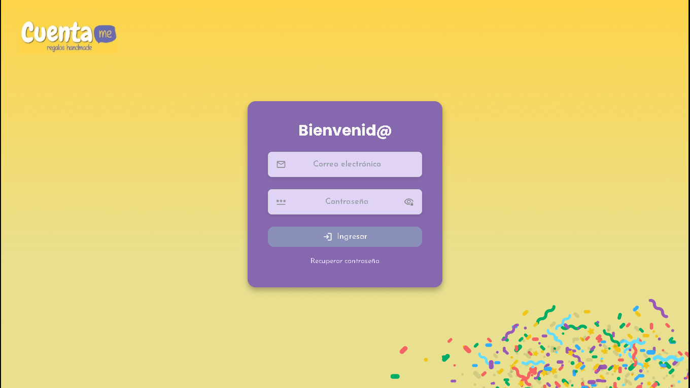
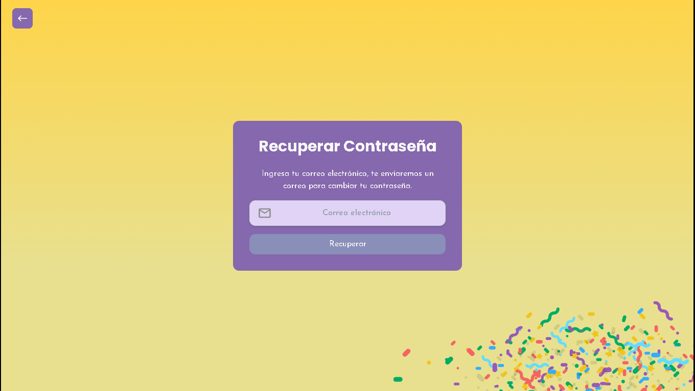
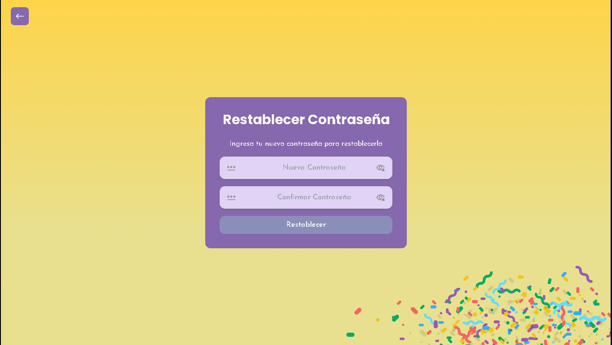
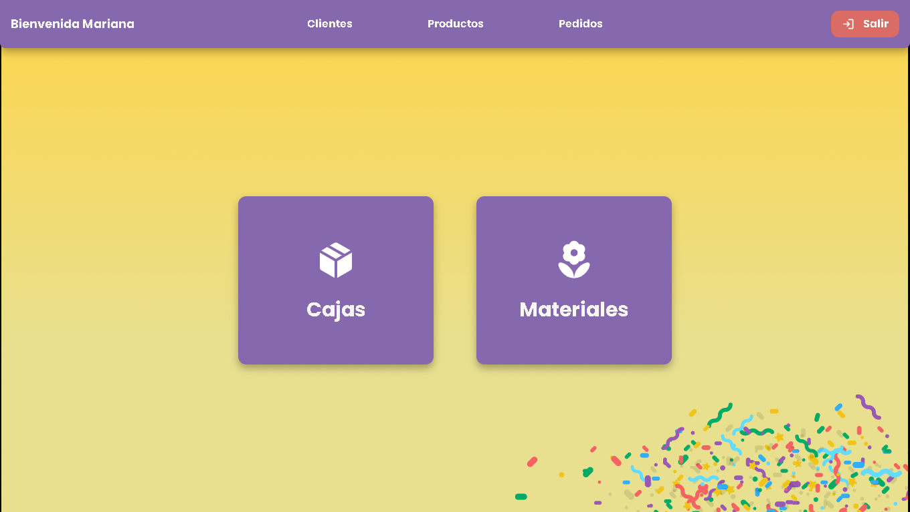
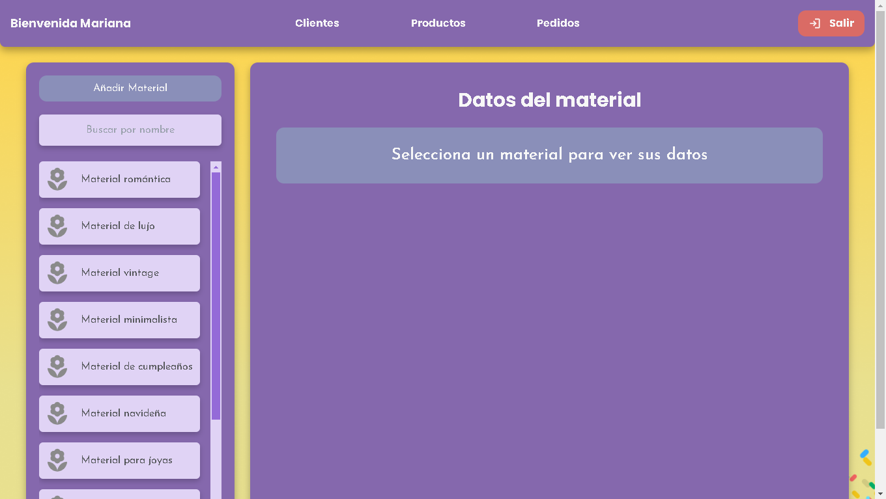
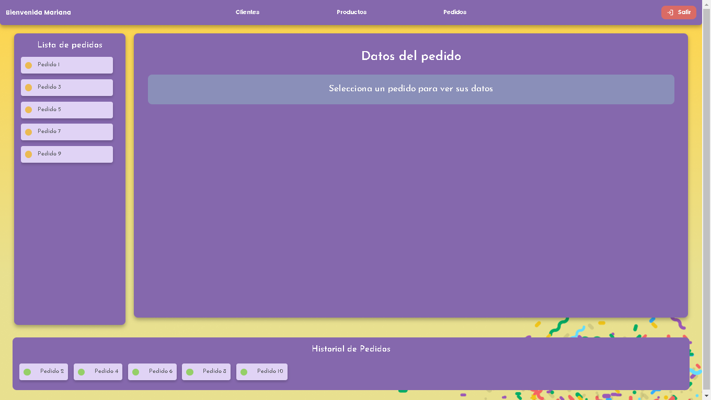

#  🎁 Sistema Frontend - CuentaMe 🎉

Sistema web para el administrador del sistema CuentaMe, empresesa dedicada a la venta de productos decorativos, de regalo y fiesta.


## 📒 Funciones
- Inicio de sesión
- Visualización de clientes
- CRUD de cajas y materiales
- Pseudo-CRUD de pedidos
- Deploy en Web usando Netlify

## 💻 Tecnologías

[](https://skillicons.dev)

## ⏬ Instalación

Clona el proyecto

```bash
  https://github.com/Mino-Mateo/Tesis.git
```

Ve a la carpeta del proyecto

```bash
  cd Frontend-CuentaMe
```

Instala las dependencias

```bash
  npm install
```

Ejecuta el proyecto en Local
```bash
  npm run dev
```


## 🧩 Uso/Ejemplos

### 🚪 Login





### 👁️ Visualización de clientes


### ✍️ CRUD de cajas y materiales





### 📝 Pseudo CRUD de pedidos




## 🌎 Demo

Si quieres probar el sistema puedes hacerlo desde el siguiente enlace:

```link
https://cuentamesistem.netlify.app/
```
## 🎥 Video Demostrativo

Esta es un guía visual sobre como manejar el sistema

https://github.com/Mino-Mateo/Examen_Moviles_Chat/assets/118315392/855443f6-8948-4503-bd05-7c5dd420e7c2

